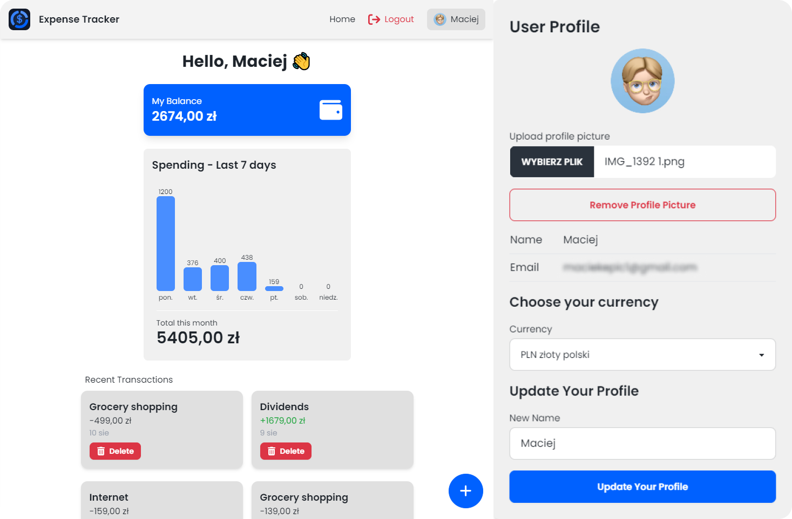
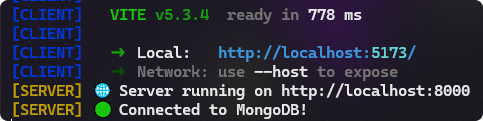

<p align="center">

<h1>💸 Expense Tracker</h1>
<h3>A simple expense tracker application with authentication built with the MERN stack.</h3>
</p>


<p align="center">

</p>

## Tech stack

<ul style="display: flex; flex-direction: column; gap:6px;">
  <li style="vertical-align: middle;">
     React
  </li>
  <li style="vertical-align: middle;">
     Redux
  </li>
   <li style="vertical-align: middle;">
     TypeScript
  </li>
   <li style="vertical-align: middle;">
     Vite
  </li>
   <li style="vertical-align: middle;">
     Tailwind CSS
  </li>
   <li style="vertical-align: middle;">
     DaisyUI
  </li>
    <li style="vertical-align: middle;">
     Node.js
  </li>
    <li style="vertical-align: middle;">
     Express
  </li>
     <li style="vertical-align: middle;">
     MongoDB
  </li>
</ul>

## Features

- Dark Mode
- Currency Selection with Intl API [https://codepen.io/maciekt07/pen/zYVdPLy](https://codepen.io/maciekt07/pen/zYVdPLy)
- Profile Picture Upload
- JWT Authentication

## To run this project locally

### 1. Clone the Repository

First, clone the project repository from GitHub.

```bash
git clone https://github.com/maciekt07/ExpenseTracker.git
cd ExpenseTracker
```

### 2. Configure Environment Variables

Create a .env file and fill it with your MongoDB token and JSON Web Token (JWT) key. You can use .env.example as a reference for the required format.

```env
MONGODB_URI=your_mongodb_token
JWT_SECRET=your_jwt_secret
```

### 3. Install Backend Dependencies

```bash
npm install
```

### 4. Install Frontend Dependencies

```bash
cd frontend
npm install
```

### 5. Run the Server and Client

```bash
cd ..
npm run dev
```



The server will start running on port 8000.

The client will start running on port 5173.

## Credits

Made with ❤️ by [maciekt07](https://github.com/maciekt07).

Inspired by [Traversy Media Course](https://youtu.be/-0exw-9YJBo?si=Sb0nOUDenxp5Ez3X).
